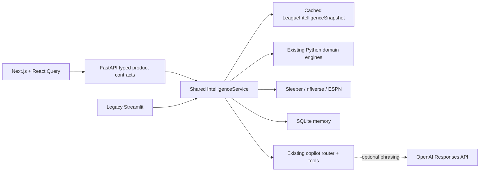

# FanEdge

FanEdge is an AI-powered fantasy football strategist for real Sleeper leagues. It combines exact league ownership, completed-game production, roster construction, and constrained AI explanation.

**M13 product:** Next.js / React / TypeScript frontend + FastAPI + the existing Python intelligence engine, now with **league-wide trade discovery** in Market → Trades and Ask FanEdge. Streamlit is retained as a **legacy/reference UI**, not the product frontend. See [the trade model, candid real-league audit, and measurements](docs/M13_TRADES.md) and [the M12 migration report](docs/M12_MIGRATION.md).

## MVP functionality

- Resolves a Sleeper username and loads the user's current-season NFL leagues
- Displays league size and scoring format
- Imports the user's real roster and separates starters from bench players
- Maps Sleeper player IDs to names, positions, and NFL teams
- Produces three AI strategy cards: **Start/Sit**, **Roster Move**, and **Risk Watch**
- Detects the current NFL week from Sleeper and maps rostered teams to the weekly schedule
- Shows verified opponent, home/away, kickoff, and Sleeper injury status when available
- Calculates recent and season fantasy averages from completed nflverse game data when league scoring is fully supported
- Builds an exact league ownership index across starters, bench, reserve/IR, taxi, and practice-squad containers
- Ranks 5–10 actually available QB/RB/WR/TE options against the user's roster-depth, injury, and bye needs
- Generates optional waiver explanations from only the deterministic shortlist and conservative bench-only drop candidates
- Models the league's actual starting slots, including flex and superflex eligibility, and checks the current lineup for material bench challenges
- Adds completed-game opportunity context: attempts, carries, targets, receptions, touches, and conservative usage trends
- Blends prior-season baselines with current evidence, adds offensive snap participation, deterministic roles, role trends, and weekly teammate-availability changes
- Handles missing users, leagues, rosters, player metadata, API failures, and missing AI configuration
- Caches read-heavy Sleeper data for a responsive experience
- Profiles every league roster and discovers bounded 1:1, 2:1 and 1:2 trades using complementary needs, relative evidence value, replacement options and both post-trade lineups
- Supports protected players, willing-to-move preferences, positional goals, opponent-player targeting, manual analysis and deterministic trade questions in Ask
- Rejects one-sided/invalid/weak-evidence packages rather than manufacturing results; confidence is evidence quality, never an acceptance probability

## Architecture



- `frontend/` owns the App Router product shell, responsive React primitives, browser query cache, and Playwright tests. It performs no football calculations.
- `backend/services.py` owns shared snapshot construction, provider caches, and scoped copilot context. `backend/main.py` exposes thin API routes; `schemas.py` and `presenter.py` define normalized product contracts.
- `app.py` retains the Streamlit reference UI and consumes the same shared service.
- `sleeper_api.py` provides defensive HTTP access and converts Sleeper IDs into display-ready roster objects.
- `strategy_engine.py` creates a factual roster context, calls OpenAI, and parses the required recommendations.
- `football_data.py` normalizes Sleeper state/status plus nflverse schedule and completed-game statistics into provider-neutral weekly context.
- `player_identity.py` resolves Sleeper players to nflverse GSIS IDs through provider IDs, exact normalized identity, and a unique name/position trade-lag fallback. Ambiguous matches stay unresolved.
- `waiver_engine.py` owns league-wide exclusion, roster-needs analysis, transparent candidate scoring, and conservative drop-candidate generation.
- `opportunity.py` derives position-aware completed-game usage summaries from nflverse weekly statistics.
- `lineup_optimizer.py` normalizes Sleeper lineup slots and solves a deterministic one-to-one starter/bench assignment.
- `trades.py` owns bounded deterministic trade discovery and two-sided simulation; `backend/trade_api.py` and `backend/trade_copilot.py` expose it without changing the existing football engines.
- `team_identity.py` maps explicit provider aliases to one of 32 canonical current NFL team IDs.
- `matchup.py` calculates completed-game fantasy points allowed by defense and offensive position under the selected league's scoring.
- `intelligence.py` normalizes historical baselines, participation, roles, evidence quality, and same-position teammate availability changes.
- `opportunity_engine.py` converts factual change signals into corroborated events, user relevance, prioritized opportunities/risks, recommended actions, and structured explanation bundles.
- `memory.py` defines stable event identity, meaningful-evidence fingerprints, lifecycle transitions, temporal summaries, feedback states, and neutral outcome classifications.
- `storage.py` implements the replaceable persistence boundary with versioned SQLite schema initialization, scoped snapshots, current event state, decision records, feedback, outcomes, and local product analytics.
- `outcomes.py` evaluates completed lineup comparisons from league-scored game results when both players' data is available.
- `news.py` fetches one bounded NFL RSS batch, normalizes stories, resolves exact player/team identities, extracts source-bounded facts, and reconciles duplicates, contradictions, and freshness.
- `news_intelligence.py` connects normalized facts to ownership, available teammates, role evidence, and roster need through an inspectable impact graph before extending the existing opportunity feed.
- `copilot.py` owns Ask FanEdge intent routing, contextual player resolution, narrow capability retrieval, deterministic grounded answers, inspectable evidence, conversational follow-ups, and optional constrained response phrasing.

## Product experience

The connected experience has four destinations: **Home**, **Team**, **Market**, and **Ask FanEdge**. Desktop uses persistent left navigation; mobile has a bottom bar. Home is **Your Edge**, a personalized feed with evidence, news, feedback, and decision history. Team renders actual starting slots and bench in compact rows and shows lineup comparisons. Market separates qualified waiver candidates from watchlist signals, with position/search filters. Clicking a player opens a detail drawer without leaving the page. Ask FanEdge supports structured player/action/evidence responses and scoped follow-ups.

Next.js presentation is built from scratch in `frontend/src/components/` and `frontend/src/app/globals.css`, not copied from Streamlit markup or styles. `styles.py` and `components.py` serve only the reference UI. Neither frontend owns lineup, waiver, schedule, identity, or role calculations.

The dashboard intentionally computes the intelligence batch once, then lets the user move between views without per-player HTTP calls. Missing or unsupported data is shown as an explicit limitation; it is never converted into a negative recommendation.

## Opportunity Engine

The M8 pipeline is deterministic: **facts → signals → events → user relevance → opportunity/risk → priority → action → explanation bundle**. Signal detectors use position-specific workload, snap participation, role trend, production, verified schedule, Sleeper status, matchup evidence, and exact league ownership. Trends require the existing four-game evidence gate and material magnitude thresholds. Multiple signals of the same type do not count as corroboration, contradictory change evidence creates neither a breakout nor decline event, and a fantasy-point spike without workload support is suppressed.

Events become user-facing only when they affect a current starter, the user's bench, a direct lineup alternative, or a confirmed available player aligned with the user's roster. Actions are categorical—`ADD`, `CONSIDER_ADD`, `START`, `CONSIDER_START`, `MONITOR`, `HOLD`, `REVIEW`, or `NO_ACTION`—and do not force a transaction. Priorities are `CRITICAL`, `HIGH`, `MEDIUM`, or `LOW`, derived from four integer axes: actionability, user relevance, evidence quality, and urgency. No arbitrary probability is shown.

Opportunity objects retain stable IDs, subject/related players, structured signals, relevance relationships, confidence, action, and explanation facts. Nullable `first_seen_week`, `last_seen_week`, `resolved`, and `action_taken` fields reserve a future persistence contract without pretending that history is stored today. When no event clears the threshold, Overview shows a deliberate quiet state instead of manufacturing advice.

## Intelligence memory and decision journal

FanEdge persists only product-relevant state—not full Sleeper or nflverse payloads—to a local SQLite database. A conceptual event key is derived from the user, league, season, event type, primary player, related player, and lineup slot where applicable. Evidence fingerprints exclude timestamps and observation week, so rerunning unchanged intelligence produces `ACTIVE`, not another `NEW` event. Materially stronger or weaker priority/action/confidence becomes `STRENGTHENED` or `WEAKENED`; equal-strength evidence changes become `CHANGED`; a returned event becomes `REOPENED`.

An absent event requires two consecutive fresh snapshots before becoming `RESOLVED`. Failed or incomplete provider refreshes do not advance that counter and instead preserve the event with uncertain freshness. The Overview prioritizes new and changed intelligence, summarizes changes since the previous meaningful snapshot, offers optional Done/Save/Dismiss controls, and exposes a compact decision journal. Feedback is observational only and does not change rankings or future recommendations.

Structured lineup and waiver decisions retain the recommendation, players, evidence fingerprint, confidence, week, and timestamps. After a later week begins, lineup records can compare completed league-scored points for the recommended and alternative players. Outcomes use neutral labels such as `RECOMMENDATION_OUTSCORED_ALTERNATIVE`; they are not causal accuracy claims. Missing game data remains explicitly unavailable.

### Product measurement framework

- **North star candidate — Weekly Action Rate:** percentage of active connected users who save or mark done on at least one FanEdge recommendation in a fantasy week.
- **Activation:** percentage of connected users who reach a populated Your Edge feed.
- **Discovery:** percentage of surfaced recommendations whose explanation is opened.
- **Action:** percentage of surfaced recommendations saved or marked done.
- **Return:** percentage of connected users who return in a subsequent fantasy week.
- **Signal quality:** percentage of surfaced opportunities later supported by stronger evidence.
- **Noise:** dismissal rate by opportunity type.

M9 records the necessary local analytics events behind a small repository method and does not send data to a third-party vendor. These are metric definitions only; FanEdge does not claim measured values yet.

## Visual identity

Player imagery is resolved centrally in `visuals.py` using deterministic ESPN CDN URLs from resolved ESPN IDs. Team marks use the same public CDN family with canonical FanEdge team IDs and a centralized 32-team color/name map. Images are lazy-loaded, and every player has an initials/position/team-color fallback so a missing remote asset never breaks a roster, lineup, or waiver component. FanEdge does not scrape pages or bundle image files.

## Schedule integrity

Schedule context has three explicit states: `SCHEDULED`, `BYE`, and `UNKNOWN`. Missing a game is never sufficient evidence for a bye. nflverse and Sleeper team IDs are normalized through a centralized, deterministic alias table—for example, nflverse `LA` becomes canonical `LAR`.

Before FanEdge infers a bye, the target weekly schedule must contain 12–16 valid games, an even set of known canonical teams, no duplicated team assignments, no impossible self-matchups, and no malformed team identities. A failed fetch, truncated week, malformed row, or unknown player team yields `UNKNOWN`, which carries no optimizer bye penalty.

## Waiver ranking

Only active, well-formed QB/RB/WR/TE records not found in any league roster container enter the candidate pool. Early production is discounted by the same current-evidence weight used by the lineup engine. Rising opportunity, expanding role, rising snap share, and factual same-position teammate unavailability can lift a candidate before fantasy points catch up; a touchdown-driven game without workload support cannot dominate the score. Roster fit, injury/bye pressure, and availability remain explicit adjustments. Missing performance remains unknown rather than zero. Results use stable name/ID tie-breakers and are capped at three players per position.

Drop candidates are limited to the user's bench, require at least two completed games, exclude injured stashes, and are omitted when the position is already shallow. They are options for AI explanation—not automatic drop instructions.

## Lineup optimization

FanEdge reads the league's real `roster_positions` rather than assuming a standard lineup. Each duplicate slot remains independent, with explicit eligibility for FLEX, WR/RB flex, receiver flex, superflex, K, and DEF.

The comparison signal combines completed-game fantasy production, historical baseline, position-aware opportunity, offensive snap share, role/role trend, current availability, verified byes, and league-scored matchup evidence. It is an inspectable comparison—not a projection. Differences under 2 points retain the current starter automatically; 2–3.99 is a close call, 4–7.99 is consider swap, and 8+ is strong swap. In a one-game sample, a recommendation requires corroboration from history, participation, role, availability, or injury, and a nominal strong swap is capped at consider. Out/IR/PUP and verified-bye starters retain their safety handling. A dynamic-programming assignment maximizes total evidence-backed improvement while ensuring one bench player fills at most one slot.

Current evidence receives 25% weight per completed game: 25% after one, 50% after two, 75% after three, and 100% at four. The remainder is a prior-season baseline when one exists. A team change halves the remaining historical influence. This is a confidence blend, not a point projection. Rookies and players without history use current evidence at low quality rather than receiving invented priors.

Usage and participation trends require four completed games. Opportunity compares the latest two-game position-specific workload with the preceding games using the larger of 1.5 opportunities or 20%. Snap trend uses a 12-percentage-point threshold. One-to-three-game trends remain `INSUFFICIENT DATA`. nflverse weekly stats supply attempts, carries, targets, receptions, and derived touches. Its snap-count release supplies offensive snaps and offensive snap percentage. Routes and route participation are not present consistently and remain null.

Role thresholds are position-specific and intentionally coarse. QB volume bands are 28/18/8 attempts; RB bands are 18/11/6 touches; WR bands are 8/5/3 targets; TE bands are 7/4/2 targets. A 75%/55%/30% snap share can independently support featured/starter/rotational status. With four games, an expanding lower-volume role becomes `EMERGING`; a shrinking non-limited role becomes `DECLINING`. Production trend is kept separate from role trend.

Every lineup decision now retains structured evidence, deterministic reason codes, and provenance. Evidence confidence is `LOW`, `MODERATE`, or `HIGH`, based on performance/usage coverage, sample size, identity resolution, decision magnitude, and verified injury/bye evidence. It is not an outcome probability. One-game evidence is capped at moderate confidence.

Matchup labels aggregate league-scored points conceded by defense, position, and week. Before four current games, the current average receives 25% weight per game and the prior season supplies the remainder. At four games it becomes fully current. At least four combined defense-games are required; at least 15% above league average is `FAVORABLE`, at least 15% below is `DIFFICULT`, and the rest is `NEUTRAL`. Every value is marked `HISTORICAL`, `MIXED`, or `CURRENT`.

Weekly nflverse injury reports are compared by GSIS player, team, and position. FanEdge records a factual previous/current status only when a same-position teammate becomes unavailable; it never claims the remaining player inherits that workload. The 2026 depth-chart release is a 51 MB current snapshot with a recently changed schema and no trustworthy prior snapshot in the release. M5 therefore omits depth-chart-rise/fall claims and does not load that file in the app. Current rank parsing exists for a future validated snapshot history, but it does not affect recommendations today.

No external database or authentication is used in this MVP. Local SQLite supplies the initial memory architecture.

## Personalized NFL news intelligence

M10 adds current reporting as a separate evidence layer: **news → entity resolution → fact extraction → league relevance → corroboration → fantasy impact → action**. It does not add a generic news feed. A story is visible only when a resolved fact connects to the selected roster or to an available same-team, same-position player who already has independent structured role evidence.

FanEdge uses ESPN's official NFL RSS feed at `https://www.espn.com/espn/rss/nfl/news`. ESPN explicitly publishes this feed for news-reader/syndication use. FanEdge retains the publisher, timestamp, canonical URL, and a short unchanged supporting excerpt, always links back to ESPN, and never fetches article pages. The implementation also evaluated NFL.com (its legacy `?service=rss` endpoint currently returns HTML), Yahoo Sports' valid but broad syndicated NFL RSS feed, PFF's analysis-oriented RSS feeds, and FantasySP's non-commercial aggregated feeds. ESPN alone was selected as the smallest timely default with clear machine-readable delivery; adding more sources would increase duplicate and licensing complexity without being necessary for the first milestone.

Full player names resolve exactly. A surname resolves only when one explicit canonical team is present and that team has exactly one matching active fantasy player. Ambiguous mentions remain unresolved. Extraction is deterministic and intentionally narrow: explicit status, practice, transaction, and attributable coach-workload statements become normalized facts; predictions, implications, and unsupported speculation do not. Reported facts and FanEdge inferences remain separately labeled in every explanation.

Equivalent reports collapse into one fact while preserving their source references. Conflicts retain superseded fact IDs, prefer current over stale information, and then prefer explicit and more authoritative reporting. Freshness is deterministic: `BREAKING` through two hours, `RECENT` through 48 hours, and `STALE` afterward. Stale facts cannot create new user-facing impact events.

The feed is fetched as one batch and its resolved facts are cached by the shared backend for 15 minutes. Normalized facts—not article bodies—are persisted in SQLite per user/league/season. If the provider fails, FanEdge reuses the last verified fact set, marks reporting freshness uncertain, and continues running all structured football intelligence. A provider failure is never interpreted as “no news.” Ask FanEdge receives only the relevant normalized news facts already supplied in context and is explicitly prohibited from using model-memory news.

## Ask FanEdge V2

M11 turns Ask FanEdge into a league-aware, multi-turn copilot rather than a generic chat wrapper. A deterministic router recognizes weekly planning, recent changes, lineup and start/sit decisions, waivers, drops, roster strengths and weaknesses, player analysis, injuries, news, matchups, and evidence requests. Player mentions resolve in league-relevance order: the user's roster, surfaced waiver candidates, other league-rostered players, then the active NFL universe. Ambiguity produces a clarification instead of a guessed identity.

Each intent calls only the internal capabilities it needs—for example, waiver questions retrieve confirmed available candidates, roster needs, and conservative drop options, while a player question retrieves that player's weekly context, role, opportunity, matchup, news, and surfaced events. The deterministic answer is always available. When an OpenAI key is configured, the Responses API may improve phrasing under a strict supplied-context contract, but it cannot change the deterministic action, confidence, uncertainty, or hypothetical label. Provider failure falls back to the same grounded answer without disabling chat.

Conversation messages live in React memory and reset on league change or page reload. The backend retains only the previous classified intent and grounded answer in a bounded one-hour cache scoped to user/league/season/conversation ID. The reference UI retains its session-state conversation. Hypotheticals are visibly labeled and never mutate roster or decision memory. Analytics record only intent category, follow-up/hypothetical flags, support status, suggestion use, and evidence opens; raw question text and transcripts are not persisted. Current facts that are not supplied—such as weather—are explicitly unsupported rather than answered from model memory.

## Tech stack

Python 3.11+, FastAPI, Pydantic, Uvicorn, Next.js 16, React 19, TypeScript, Tailwind CSS 4, TanStack Query, Lucide, SQLite, Requests, OpenAI Python SDK, python-dotenv, Sleeper, nflverse, and ESPN RSS. Streamlit is the legacy/reference runtime. Node.js 20.9+ is required for Next.js.

## Run locally

```bash
git clone https://github.com/dylanlaewe/FanEdge.git
cd FanEdge
python3 -m venv .venv
source .venv/bin/activate
pip install -r requirements.txt
cp .env.example .env
```

Add your key to `.env`:

```dotenv
OPENAI_API_KEY=your_key_here
```

Launch the backend in one terminal:

```bash
source .venv/bin/activate
uvicorn backend.main:app --host 127.0.0.1 --port 8000
```

Launch the product frontend in another:

```bash
cd frontend
npm ci
npm run dev
```

Open `http://127.0.0.1:3000`. API docs: `http://127.0.0.1:8000/docs`; health: `http://127.0.0.1:8000/health`. For a production build, use `npm run build` then `npm run start` in `frontend/`. `FANEDGE_API_URL` sets the server-side API proxy target (default `http://127.0.0.1:8000`); set it when building and running Next.js. Never place an OpenAI key in a `NEXT_PUBLIC_` variable.

Legacy/reference only:

```bash
streamlit run app.py
```

The entire deterministic Sleeper experience, including grounded Ask FanEdge answers, works without an OpenAI key. AI-assisted phrasing and legacy explanation buttons require a key. Local intelligence memory defaults to `.fanedge/fanedge.db`; set `FANEDGE_DB_PATH` to use another development path.

## Deployment boundaries

The new product needs a Node.js Next.js process plus an ASGI FastAPI process and persistent SQLite storage. Use one backend worker for the current in-process cache/session design. Keep the backend private behind the Next.js proxy. This milestone does not add authentication or a public-hosting security boundary; do not expose journal/feedback APIs as a multi-user public service without that work. No cloud deployment is performed by this migration.

### Legacy Streamlit Community Cloud

1. Push this repository to GitHub.
2. In Streamlit Community Cloud, create an app from the repository and set the entry point to `app.py`.
3. In **App settings → Secrets**, add:

   ```toml
   OPENAI_API_KEY = "your_key_here"
   ```

4. Deploy. Dependencies are installed automatically from `requirements.txt`.

Streamlit Community Cloud local disk is not durable across redeployments and may be reset. The M9 SQLite implementation is therefore appropriate for local development, architecture validation, and product testing—not durable production memory on Community Cloud. The repository boundary is intentionally replaceable by a durable service later without changing the opportunity engine.

## Current limitations

- Supports Sleeper NFL leagues only and has no authentication or cross-device identity beyond the supplied public Sleeper user ID.
- SQLite memory is local to one running environment and is not durable on ephemeral Streamlit Community Cloud storage.
- Weekly opponent and kickoff data come from nflverse; injury designations come from Sleeper metadata and may lag official club reporting.
- Cross-provider identity resolution is intentionally conservative. Unresolved or ambiguous players retain schedule/status context but do not inherit another player's statistics.
- Lineup recommendations use completed games and current availability, not future-point projections. Early-season samples are therefore intentionally conservative.
- Custom offensive scoring bonuses or unsupported scoring keys disable performance averages rather than showing inaccurate points.
- No projections or trade values are supplied. Current reporting is limited to resolved facts in ESPN's NFL RSS batch; missing coverage is unknown, and the model is explicitly prohibited from inventing unavailable news.
- The current season is selected automatically. Historical-season selection is not yet exposed.
- League co-owners are not currently resolved as roster owners.

## Roadmap

M12 is the performance and product-shell migration, not a beta launch. Trade Finder, projections, notifications, authentication, payments, social, and weather remain explicitly deferred. No subsequent feature milestone has begun.

## Validation

```bash
pip install -r requirements-dev.txt
pytest -q
cd frontend
npm ci
npm run build
npm run typecheck
npx playwright install chromium
npm test
```

The frontend suite starts a local production Next.js server if one is not already running. Its default flows use fixtures; `FANEDGE_LIVE=1 npm test` additionally exercises a populated real league against the running FastAPI backend. Profiling/parity scripts and results are documented in [M12_MIGRATION.md](docs/M12_MIGRATION.md).
