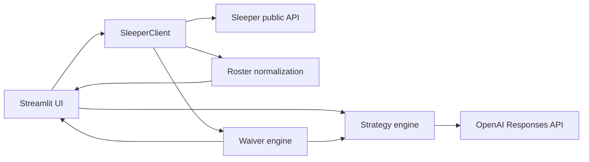

# FanEdge

FanEdge is an AI-powered fantasy football strategist for real Sleeper leagues. It combines exact league ownership, completed-game production, roster construction, and constrained AI explanation.

## MVP functionality

- Resolves a Sleeper username and loads the user's current-season NFL leagues
- Displays league size and scoring format
- Imports the user's real roster and separates starters from bench players
- Maps Sleeper player IDs to names, positions, and NFL teams
- Produces three AI strategy cards: **Start/Sit**, **Roster Move**, and **Risk Watch**
- Detects the current NFL week from Sleeper and maps rostered teams to the weekly schedule
- Shows verified opponent, home/away, kickoff, and Sleeper injury status when available
- Calculates recent and season fantasy averages from completed nflverse game data when league scoring is fully supported
- Builds an exact league ownership index across starters, bench, reserve/IR, taxi, and practice-squad containers
- Ranks 5–10 actually available QB/RB/WR/TE options against the user's roster-depth, injury, and bye needs
- Generates optional waiver explanations from only the deterministic shortlist and conservative bench-only drop candidates
- Models the league's actual starting slots, including flex and superflex eligibility, and checks the current lineup for material bench challenges
- Adds completed-game opportunity context: attempts, carries, targets, receptions, touches, and conservative usage trends
- Blends prior-season baselines with current evidence, adds offensive snap participation, deterministic roles, role trends, and weekly teammate-availability changes
- Handles missing users, leagues, rosters, player metadata, API failures, and missing AI configuration
- Caches read-heavy Sleeper data for a responsive experience

## Architecture



- `app.py` owns the Streamlit UI, caching, and session state.
- `sleeper_api.py` provides defensive HTTP access and converts Sleeper IDs into display-ready roster objects.
- `strategy_engine.py` creates a factual roster context, calls OpenAI, and parses the required recommendations.
- `football_data.py` normalizes Sleeper state/status plus nflverse schedule and completed-game statistics into provider-neutral weekly context.
- `player_identity.py` resolves Sleeper players to nflverse GSIS IDs through provider IDs, exact normalized identity, and a unique name/position trade-lag fallback. Ambiguous matches stay unresolved.
- `waiver_engine.py` owns league-wide exclusion, roster-needs analysis, transparent candidate scoring, and conservative drop-candidate generation.
- `opportunity.py` derives position-aware completed-game usage summaries from nflverse weekly statistics.
- `lineup_optimizer.py` normalizes Sleeper lineup slots and solves a deterministic one-to-one starter/bench assignment.
- `team_identity.py` maps explicit provider aliases to one of 32 canonical current NFL team IDs.
- `matchup.py` calculates completed-game fantasy points allowed by defense and offensive position under the selected league's scoring.
- `intelligence.py` normalizes historical baselines, participation, roles, evidence quality, and same-position teammate availability changes.

## Product experience

The connected experience is organized as a responsive fantasy application around four weekly jobs: **Overview**, **My Team**, **Waivers**, and **Ask FanEdge**. Desktop uses persistent left navigation; mobile converts it to a compact bottom bar. Overview is an editorial briefing rather than a KPI dashboard. My Team renders the league's real starting slots and bench as information-dense player rows, with position-specific production and workload signals. Waivers adds position filters and separates higher-priority adds from a lower-confidence watchlist. Ask FanEdge gives the existing constrained strategy explanation a first-class, honest entry point.

Presentation is split into `styles.py` and reusable sports components in `components.py`; `app.py` remains responsible for data orchestration and page composition. The redesign does not change the lineup optimizer, waiver ranking, schedule inference, identity matching, or role model.

The dashboard intentionally computes the intelligence batch once, then lets the user move between views without per-player HTTP calls. Missing or unsupported data is shown as an explicit limitation; it is never converted into a negative recommendation.

## Visual identity

Player imagery is resolved centrally in `visuals.py` using deterministic ESPN CDN URLs from resolved ESPN IDs. Team marks use the same public CDN family with canonical FanEdge team IDs and a centralized 32-team color/name map. Images are lazy-loaded, and every player has an initials/position/team-color fallback so a missing remote asset never breaks a roster, lineup, or waiver component. FanEdge does not scrape pages or bundle image files.

## Schedule integrity

Schedule context has three explicit states: `SCHEDULED`, `BYE`, and `UNKNOWN`. Missing a game is never sufficient evidence for a bye. nflverse and Sleeper team IDs are normalized through a centralized, deterministic alias table—for example, nflverse `LA` becomes canonical `LAR`.

Before FanEdge infers a bye, the target weekly schedule must contain 12–16 valid games, an even set of known canonical teams, no duplicated team assignments, no impossible self-matchups, and no malformed team identities. A failed fetch, truncated week, malformed row, or unknown player team yields `UNKNOWN`, which carries no optimizer bye penalty.

## Waiver ranking

Only active, well-formed QB/RB/WR/TE records not found in any league roster container enter the candidate pool. Early production is discounted by the same current-evidence weight used by the lineup engine. Rising opportunity, expanding role, rising snap share, and factual same-position teammate unavailability can lift a candidate before fantasy points catch up; a touchdown-driven game without workload support cannot dominate the score. Roster fit, injury/bye pressure, and availability remain explicit adjustments. Missing performance remains unknown rather than zero. Results use stable name/ID tie-breakers and are capped at three players per position.

Drop candidates are limited to the user's bench, require at least two completed games, exclude injured stashes, and are omitted when the position is already shallow. They are options for AI explanation—not automatic drop instructions.

## Lineup optimization

FanEdge reads the league's real `roster_positions` rather than assuming a standard lineup. Each duplicate slot remains independent, with explicit eligibility for FLEX, WR/RB flex, receiver flex, superflex, K, and DEF.

The comparison signal combines completed-game fantasy production, historical baseline, position-aware opportunity, offensive snap share, role/role trend, current availability, verified byes, and league-scored matchup evidence. It is an inspectable comparison—not a projection. Differences under 2 points retain the current starter automatically; 2–3.99 is a close call, 4–7.99 is consider swap, and 8+ is strong swap. In a one-game sample, a recommendation requires corroboration from history, participation, role, availability, or injury, and a nominal strong swap is capped at consider. Out/IR/PUP and verified-bye starters retain their safety handling. A dynamic-programming assignment maximizes total evidence-backed improvement while ensuring one bench player fills at most one slot.

Current evidence receives 25% weight per completed game: 25% after one, 50% after two, 75% after three, and 100% at four. The remainder is a prior-season baseline when one exists. A team change halves the remaining historical influence. This is a confidence blend, not a point projection. Rookies and players without history use current evidence at low quality rather than receiving invented priors.

Usage and participation trends require four completed games. Opportunity compares the latest two-game position-specific workload with the preceding games using the larger of 1.5 opportunities or 20%. Snap trend uses a 12-percentage-point threshold. One-to-three-game trends remain `INSUFFICIENT DATA`. nflverse weekly stats supply attempts, carries, targets, receptions, and derived touches. Its snap-count release supplies offensive snaps and offensive snap percentage. Routes and route participation are not present consistently and remain null.

Role thresholds are position-specific and intentionally coarse. QB volume bands are 28/18/8 attempts; RB bands are 18/11/6 touches; WR bands are 8/5/3 targets; TE bands are 7/4/2 targets. A 75%/55%/30% snap share can independently support featured/starter/rotational status. With four games, an expanding lower-volume role becomes `EMERGING`; a shrinking non-limited role becomes `DECLINING`. Production trend is kept separate from role trend.

Every lineup decision now retains structured evidence, deterministic reason codes, and provenance. Evidence confidence is `LOW`, `MODERATE`, or `HIGH`, based on performance/usage coverage, sample size, identity resolution, decision magnitude, and verified injury/bye evidence. It is not an outcome probability. One-game evidence is capped at moderate confidence.

Matchup labels aggregate league-scored points conceded by defense, position, and week. Before four current games, the current average receives 25% weight per game and the prior season supplies the remainder. At four games it becomes fully current. At least four combined defense-games are required; at least 15% above league average is `FAVORABLE`, at least 15% below is `DIFFICULT`, and the rest is `NEUTRAL`. Every value is marked `HISTORICAL`, `MIXED`, or `CURRENT`.

Weekly nflverse injury reports are compared by GSIS player, team, and position. FanEdge records a factual previous/current status only when a same-position teammate becomes unavailable; it never claims the remaining player inherits that workload. The 2026 depth-chart release is a 51 MB current snapshot with a recently changed schema and no trustworthy prior snapshot in the release. M5 therefore omits depth-chart-rise/fall claims and does not load that file in the app. Current rank parsing exists for a future validated snapshot history, but it does not affect recommendations today.

No database or authentication is used in this MVP.

## Tech stack

Python 3.11+, Streamlit, Requests, OpenAI Python SDK, python-dotenv, Sleeper's public API, and nflverse release data.

## Run locally

```bash
git clone https://github.com/dylanlaewe/FanEdge.git
cd FanEdge
python3 -m venv .venv
source .venv/bin/activate
pip install -r requirements.txt
cp .env.example .env
```

Add your key to `.env`:

```dotenv
OPENAI_API_KEY=your_key_here
```

Then launch the app:

```bash
streamlit run app.py
```

The Sleeper roster experience still works without an OpenAI key; only strategy generation is disabled.

## Deploy to Streamlit Community Cloud

1. Push this repository to GitHub.
2. In Streamlit Community Cloud, create an app from the repository and set the entry point to `app.py`.
3. In **App settings → Secrets**, add:

   ```toml
   OPENAI_API_KEY = "your_key_here"
   ```

4. Deploy. Dependencies are installed automatically from `requirements.txt`.

## Current limitations

- Supports Sleeper NFL leagues only and has no user accounts or saved history.
- Weekly opponent and kickoff data come from nflverse; injury designations come from Sleeper metadata and may lag official club reporting.
- Cross-provider identity resolution is intentionally conservative. Unresolved or ambiguous players retain schedule/status context but do not inherit another player's statistics.
- Lineup recommendations use completed games and current availability, not future-point projections. Early-season samples are therefore intentionally conservative.
- Custom offensive scoring bonuses or unsupported scoring keys disable performance averages rather than showing inaccurate points.
- No projections, trade values, or news are supplied. Waiver availability is based only on Sleeper league ownership, and the model is explicitly told not to invent unavailable facts.
- The current season is selected automatically. Historical-season selection is not yet exposed.
- League co-owners are not currently resolved as roster owners.

## Roadmap

- Add trustworthy projections and deeper usage signals
- Support weekly lineup slots and player-level projections
- Add saved teams, recommendation history, and outcome tracking
- Expand to trades, multi-league dashboards, and additional fantasy platforms
