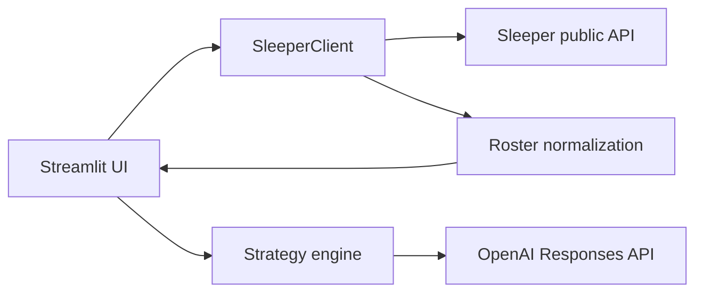

# FanEdge

FanEdge is an AI-powered fantasy football strategist for real Sleeper leagues. Enter a Sleeper username, choose an NFL league, import the actual roster, and receive three concise, roster-specific recommendations.

## MVP functionality

- Resolves a Sleeper username and loads the user's current-season NFL leagues
- Displays league size and scoring format
- Imports the user's real roster and separates starters from bench players
- Maps Sleeper player IDs to names, positions, and NFL teams
- Produces three AI strategy cards: **Start/Sit**, **Roster Move**, and **Risk Watch**
- Handles missing users, leagues, rosters, player metadata, API failures, and missing AI configuration
- Caches read-heavy Sleeper data for a responsive experience

## Architecture



- `app.py` owns the Streamlit UI, caching, and session state.
- `sleeper_api.py` provides defensive HTTP access and converts Sleeper IDs into display-ready roster objects.
- `strategy_engine.py` creates a factual roster context, calls OpenAI, and parses the required recommendations.

No database or authentication is used in this MVP.

## Tech stack

Python 3.11+, Streamlit, Requests, OpenAI Python SDK, and python-dotenv.

## Run locally

```bash
git clone https://github.com/dylanlaewe/FanEdge.git
cd FanEdge
python3 -m venv .venv
source .venv/bin/activate
pip install -r requirements.txt
cp .env.example .env
```

Add your key to `.env`:

```dotenv
OPENAI_API_KEY=your_key_here
```

Then launch the app:

```bash
streamlit run app.py
```

The Sleeper roster experience still works without an OpenAI key; only strategy generation is disabled.

## Deploy to Streamlit Community Cloud

1. Push this repository to GitHub.
2. In Streamlit Community Cloud, create an app from the repository and set the entry point to `app.py`.
3. In **App settings → Secrets**, add:

   ```toml
   OPENAI_API_KEY = "your_key_here"
   ```

4. Deploy. Dependencies are installed automatically from `requirements.txt`.

## Current limitations

- Supports Sleeper NFL leagues only and has no user accounts or saved history.
- Uses roster and league metadata, not live injuries, news, projections, matchups, waiver availability, or trade values.
- Advice quality is constrained accordingly; the model is explicitly told not to invent unavailable facts.
- The current season is selected automatically. Historical-season selection is not yet exposed.
- League co-owners are not currently resolved as roster owners.

## Roadmap

- Add trustworthy injury, matchup, projection, and schedule context
- Add waiver-wire and free-agent recommendations
- Support weekly lineup slots and player-level projections
- Add saved teams, recommendation history, and outcome tracking
- Expand to trades, multi-league dashboards, and additional fantasy platforms
