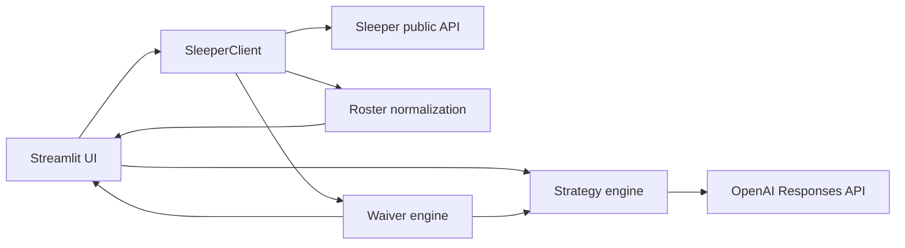

# FanEdge

FanEdge is an AI-powered fantasy football strategist for real Sleeper leagues. It combines exact league ownership, completed-game production, roster construction, and constrained AI explanation.

## MVP functionality

- Resolves a Sleeper username and loads the user's current-season NFL leagues
- Displays league size and scoring format
- Imports the user's real roster and separates starters from bench players
- Maps Sleeper player IDs to names, positions, and NFL teams
- Produces three AI strategy cards: **Start/Sit**, **Roster Move**, and **Risk Watch**
- Detects the current NFL week from Sleeper and maps rostered teams to the weekly schedule
- Shows verified opponent, home/away, kickoff, and Sleeper injury status when available
- Calculates recent and season fantasy averages from completed nflverse game data when league scoring is fully supported
- Builds an exact league ownership index across starters, bench, reserve/IR, taxi, and practice-squad containers
- Ranks 5–10 actually available QB/RB/WR/TE options against the user's roster-depth, injury, and bye needs
- Generates optional waiver explanations from only the deterministic shortlist and conservative bench-only drop candidates
- Models the league's actual starting slots, including flex and superflex eligibility, and checks the current lineup for material bench challenges
- Adds completed-game opportunity context: attempts, carries, targets, receptions, touches, and conservative usage trends
- Handles missing users, leagues, rosters, player metadata, API failures, and missing AI configuration
- Caches read-heavy Sleeper data for a responsive experience

## Architecture



- `app.py` owns the Streamlit UI, caching, and session state.
- `sleeper_api.py` provides defensive HTTP access and converts Sleeper IDs into display-ready roster objects.
- `strategy_engine.py` creates a factual roster context, calls OpenAI, and parses the required recommendations.
- `football_data.py` normalizes Sleeper state/status plus nflverse schedule and completed-game statistics into provider-neutral weekly context.
- `player_identity.py` resolves Sleeper players to nflverse GSIS IDs through provider IDs, exact normalized identity, and a unique name/position trade-lag fallback. Ambiguous matches stay unresolved.
- `waiver_engine.py` owns league-wide exclusion, roster-needs analysis, transparent candidate scoring, and conservative drop-candidate generation.
- `opportunity.py` derives position-aware completed-game usage summaries from nflverse weekly statistics.
- `lineup_optimizer.py` normalizes Sleeper lineup slots and solves a deterministic one-to-one starter/bench assignment.

## Waiver ranking

Only active, well-formed QB/RB/WR/TE records not found in any league roster container enter the candidate pool. FanEdge calculates a score from 60% recent and 40% season fantasy average, discounted for samples under four games. It then applies small, documented adjustments for trend, shallow positional depth, injury/bye pressure, and the player's availability status. Missing performance remains unknown rather than zero; those candidates can still appear when provider statistics or custom scoring are unavailable. Results use stable name/ID tie-breakers and are capped at three players per position.

Drop candidates are limited to the user's bench, require at least two completed games, exclude injured stashes, and are omitted when the position is already shallow. They are options for AI explanation—not automatic drop instructions.

## Lineup optimization

FanEdge reads the league's real `roster_positions` rather than assuming a standard lineup. Each duplicate slot remains independent, with explicit eligibility for FLEX, WR/RB flex, receiver flex, superflex, K, and DEF.

The comparison signal combines completed-game fantasy production, position-aware opportunity volume, sample size, usage trend, injury status, and verified byes. It is not a projection and does not apply an unsupported matchup-strength adjustment. Differences under 2 points retain the current starter automatically; 2–3.99 is a close call, 4–7.99 is consider swap, and 8+ is strong swap. Close calls require at least two games for both players. Out/IR/PUP and verified-bye starters receive a safety penalty only when a healthy, eligible replacement exists. A dynamic-programming assignment maximizes the total evidence-backed improvement while ensuring one bench player fills at most one slot.

Usage trend requires four completed games. It compares the most recent two-game position-specific workload average with the preceding-game average using a threshold of the larger of 1.5 opportunities or 20%. One-game starts remain `INSUFFICIENT DATA`. The current nflverse weekly dataset reliably supplies QB attempts/completions/rushes, RB carries/targets/receptions, and WR/TE targets/receptions. Broad snap share and route participation are intentionally omitted because they are not consistently present in that source.

No database or authentication is used in this MVP.

## Tech stack

Python 3.11+, Streamlit, Requests, OpenAI Python SDK, python-dotenv, Sleeper's public API, and nflverse release data.

## Run locally

```bash
git clone https://github.com/dylanlaewe/FanEdge.git
cd FanEdge
python3 -m venv .venv
source .venv/bin/activate
pip install -r requirements.txt
cp .env.example .env
```

Add your key to `.env`:

```dotenv
OPENAI_API_KEY=your_key_here
```

Then launch the app:

```bash
streamlit run app.py
```

The Sleeper roster experience still works without an OpenAI key; only strategy generation is disabled.

## Deploy to Streamlit Community Cloud

1. Push this repository to GitHub.
2. In Streamlit Community Cloud, create an app from the repository and set the entry point to `app.py`.
3. In **App settings → Secrets**, add:

   ```toml
   OPENAI_API_KEY = "your_key_here"
   ```

4. Deploy. Dependencies are installed automatically from `requirements.txt`.

## Current limitations

- Supports Sleeper NFL leagues only and has no user accounts or saved history.
- Weekly opponent and kickoff data come from nflverse; injury designations come from Sleeper metadata and may lag official club reporting.
- Cross-provider identity resolution is intentionally conservative. Unresolved or ambiguous players retain schedule/status context but do not inherit another player's statistics.
- Lineup recommendations use completed games and current availability, not future-point projections. Early-season samples are therefore intentionally conservative.
- Custom offensive scoring bonuses or unsupported scoring keys disable performance averages rather than showing inaccurate points.
- No projections, trade values, or news are supplied. Waiver availability is based only on Sleeper league ownership, and the model is explicitly told not to invent unavailable facts.
- The current season is selected automatically. Historical-season selection is not yet exposed.
- League co-owners are not currently resolved as roster owners.

## Roadmap

- Add trustworthy projections and deeper usage signals
- Support weekly lineup slots and player-level projections
- Add saved teams, recommendation history, and outcome tracking
- Expand to trades, multi-league dashboards, and additional fantasy platforms
